# Disordered regions in predicted protein structures
Exploration of whether ESMFold2 has high pLDDT disordered regions of proteins for which AlphaFold2 has low pLDDT.
Prompted by my [anecdotal observation](https://x.com/anthonygitter/status/2059738561037963602).
[Ayushman Mallick](https://x.com/AyushmanMallick/status/2060780580690907584) reported the same issue on Twitter.

I opened a [GitHub issue](https://github.com/Biohub/esm/issues/326) to discuss this.

## Disorder region structure prediction analysis

Comparison of per-residue pLDDT confidence across AlphaFold2, AlphaFold3, and ESMFold2 for 15 intrinsically disordered proteins from [DisProt](https://disprot.org). AlphaFold2 predictions are full-length database downloads; AlphaFold3 and ESMFold2 predictions use the first 700 residues for sequences longer than 700 amino acids. pLDDT values are aligned to the full UniProt reference sequence.

## Summary table

| Protein | UniProt | DisProt | Length | Disorder content | AF very low conf | AlphaFold2 | AlphaFold3 | ESMFold2 | pLDDT plot |
|---------|---------|---------|--------|-----------------|------------------|------------|------------|----------|------------|
| Late embryogenesis abundant protein | [Q5NJL5](https://www.uniprot.org/uniprotkb/Q5NJL5/entry#structure) | [DP01859](https://disprot.org/DP01859) | 358 | 1.000 | 1.000 | <a href="alphafold2/Q5NJL5.png">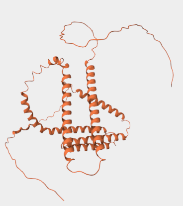</a> | <a href="alphafold3/Q5NJL5.png">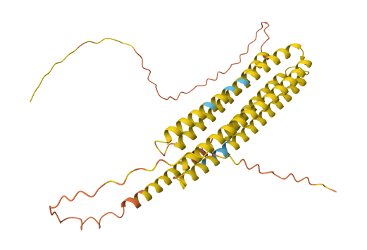</a> | <a href="esmfold2/Q5NJL5.png">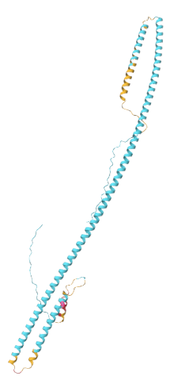</a> | [plot](#Q5NJL5-Late-embryogenesis-abundant-protein) |
| 120 kDa immunodominant surface protein | [Q2GI62](https://www.uniprot.org/uniprotkb/Q2GI62/entry#structure) | [DP01875](https://disprot.org/DP01875) | 548 | 0.146 | 1.000 | <a href="alphafold2/Q2GI62.png">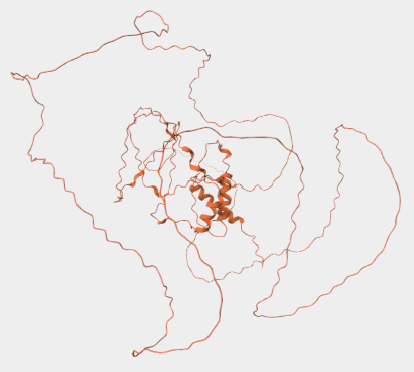</a> | <a href="alphafold3/Q2GI62.png">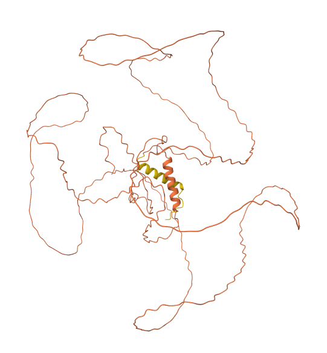</a> | <a href="esmfold2/Q2GI62.png">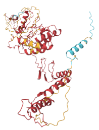</a> | [plot](#Q2GI62-120-kDa-immunodominant-surface-protein) |
| Elastin | [P04985](https://www.uniprot.org/uniprotkb/P04985/entry#structure) | [DP01801](https://disprot.org/DP01801) | 747 | 1.000 | 0.973 | <a href="alphafold2/P04985.png">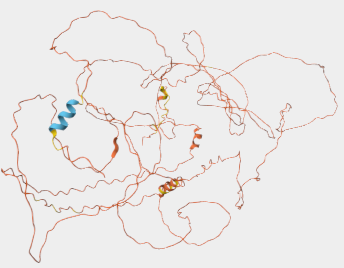</a> | <a href="alphafold3/P04985.png">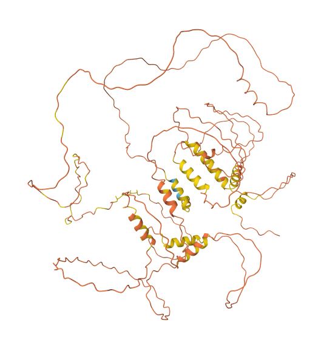</a> | <a href="esmfold2/P04985.png">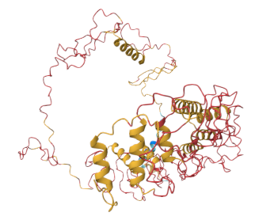</a> | [plot](#P04985-Elastin) |
| 6b protein | [Q44522](https://www.uniprot.org/uniprotkb/Q44522/entry#structure) | [DP02668](https://disprot.org/DP02668) | 204 | 0.064 | 0.971 | <a href="alphafold2/Q44522.png">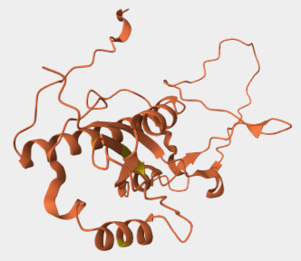</a> | <a href="alphafold3/Q44522.png">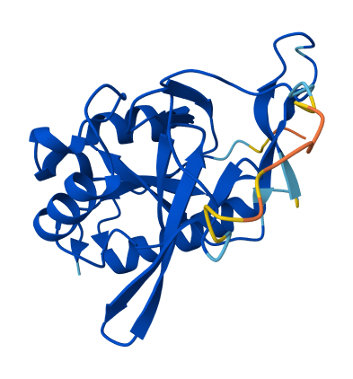</a> | <a href="esmfold2/Q44522.png">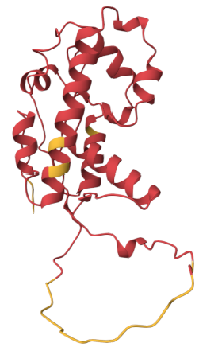</a> | [plot](#Q44522-6b-protein) |
| Putative transmembrane protein | [B6KJB6](https://www.uniprot.org/uniprotkb/B6KJB6/entry#structure) | [DP01535](https://disprot.org/DP01535) | 542 | 0.380 | 0.911 | <a href="alphafold2/B6KJB6.png">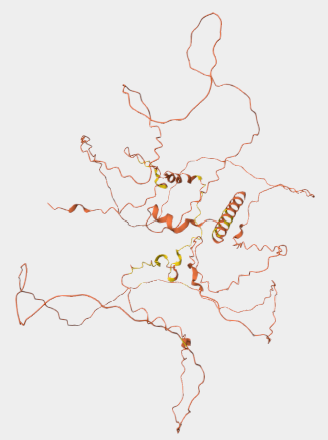</a> | <a href="alphafold3/B6KJB6.png">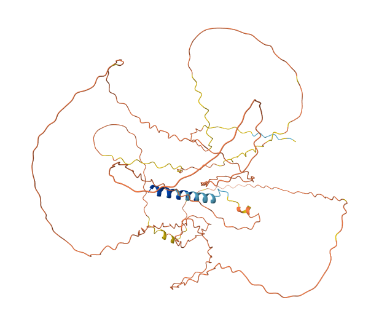</a> | <a href="esmfold2/B6KJB6.png">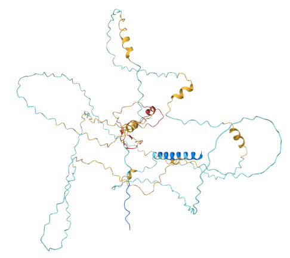</a> | [plot](#B6KJB6-Putative-transmembrane-protein) |
| Glutenin, high molecular weight subunit DX5 | [P10388](https://www.uniprot.org/uniprotkb/P10388/entry#structure) | [DP00285](https://disprot.org/DP00285) | 848 | 0.347 | 0.899 | <a href="alphafold2/P10388.png">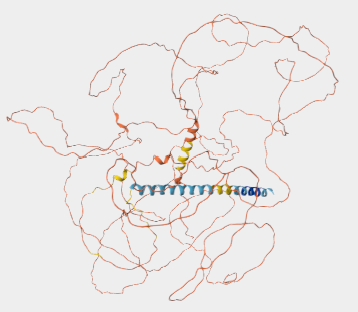</a> | <a href="alphafold3/P10388.png">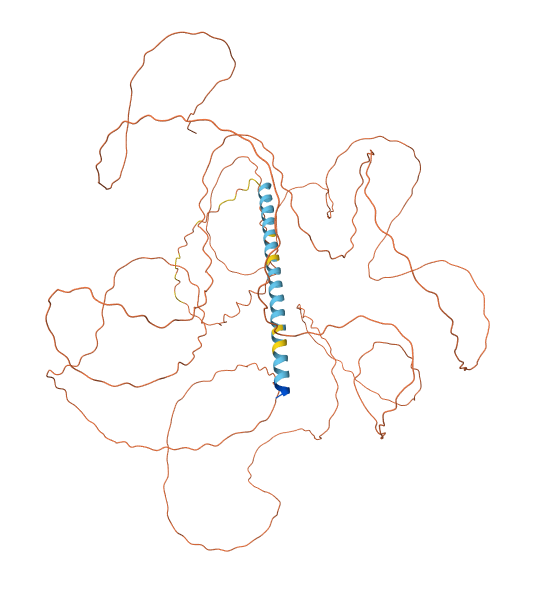</a> | <a href="esmfold2/P10388.png">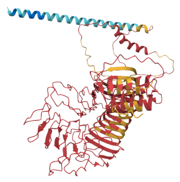</a> | [plot](#P10388-Glutenin-high-molecular-weight-subunit-DX5) |
| Transcription factor Sp1 | [P08047](https://www.uniprot.org/uniprotkb/P08047/entry#structure) | [DP00378](https://disprot.org/DP00378) | 785 | 0.276 | 0.873 | <a href="alphafold2/P08047.png">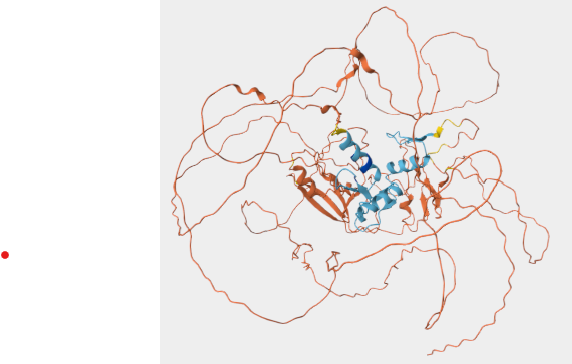</a> | <a href="alphafold3/P08047.png">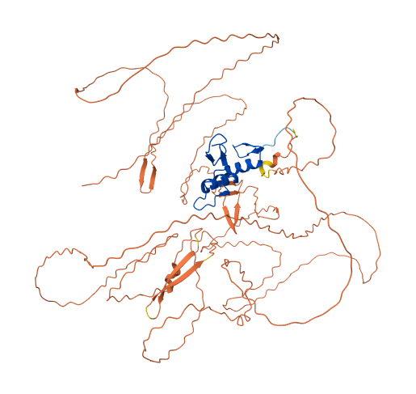</a> | <a href="esmfold2/P08047.png">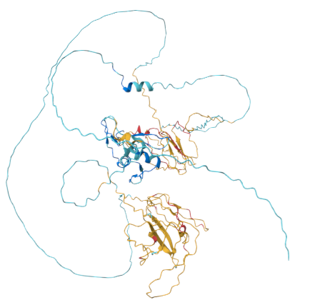</a> | [plot](#P08047-Transcription-factor-Sp1) |
| Ameloblastin | [Q9NP70](https://www.uniprot.org/uniprotkb/Q9NP70/entry#structure) | [DP02558](https://disprot.org/DP02558) | 447 | 0.942 | 0.870 | <a href="alphafold2/Q9NP70.png">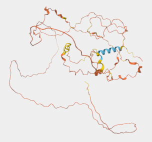</a> | <a href="alphafold3/Q9NP70.png">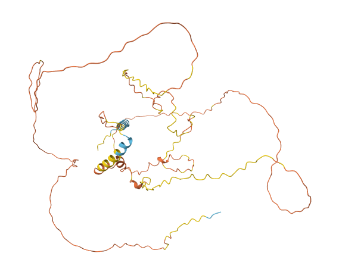</a> | <a href="esmfold2/Q9NP70.png">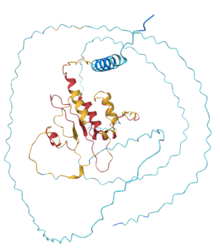</a> | [plot](#Q9NP70-Ameloblastin) |
| Nucleoporin NUP1 | [P20676](https://www.uniprot.org/uniprotkb/P20676/entry#structure) | [DP01075](https://disprot.org/DP01075) | 1076 | 0.722 | 0.859 | <a href="alphafold2/P20676.png">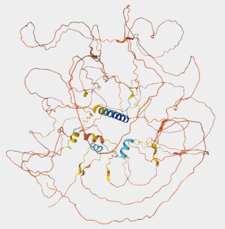</a> | <a href="alphafold3/P20676.png">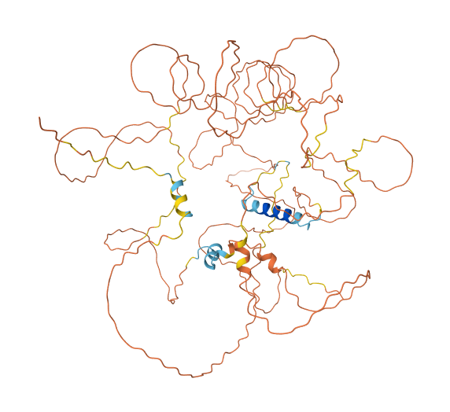</a> | <a href="esmfold2/P20676.png">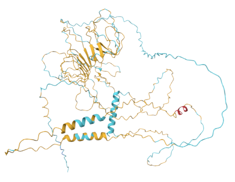</a> | [plot](#P20676-Nucleoporin-NUP1) |
| Systemin | [P27058](https://www.uniprot.org/uniprotkb/P27058/entry#structure) | [DP01969](https://disprot.org/DP01969) | 200 | 1.000 | 0.845 | <a href="alphafold2/P27058.png">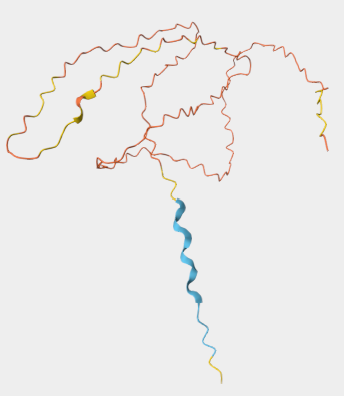</a> | <a href="alphafold3/P27058.png">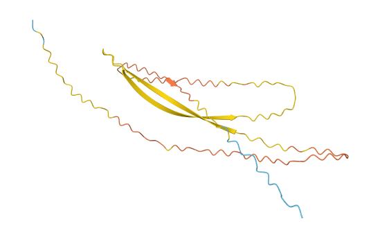</a> | <a href="esmfold2/P27058.png">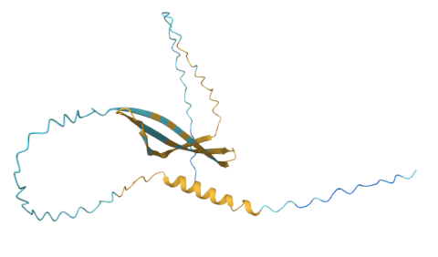</a> | [plot](#P27058-Systemin) |
| Uncharacterized protein | [Q3LS93](https://www.uniprot.org/uniprotkb/Q3LS93/entry#structure) | [DP01777](https://disprot.org/DP01777) | 329 | 0.936 | 0.842 | <a href="alphafold2/Q3LS93.png">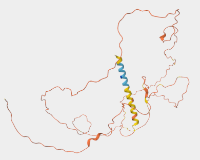</a> | <a href="alphafold3/Q3LS93.png">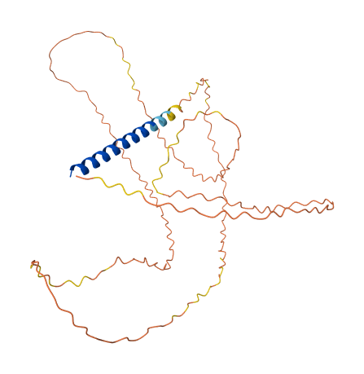</a> | <a href="esmfold2/Q3LS93.png">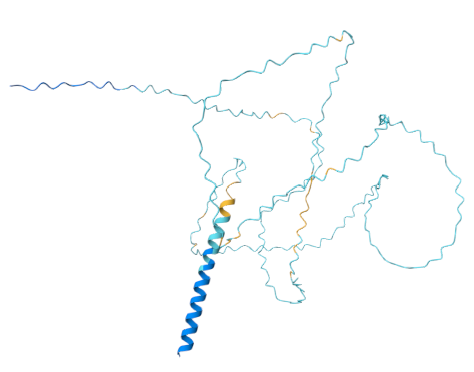</a> | [plot](#Q3LS93-Uncharacterized-protein) |
| Breast cancer type 1 susceptibility protein | [P38398](https://www.uniprot.org/uniprotkb/P38398/entry#structure) | [DP00238](https://disprot.org/DP00238) | 1863 | 0.832 | 0.803 | <a href="alphafold2/P38398.png">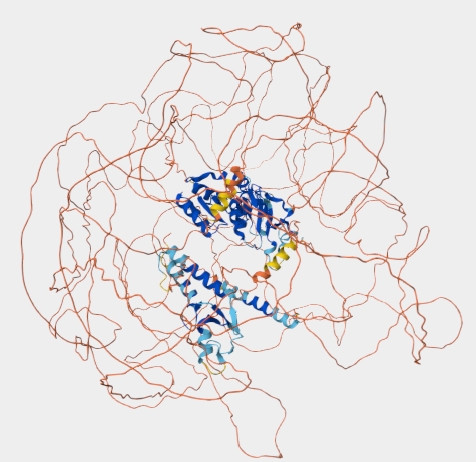</a> | <a href="alphafold3/P38398.png">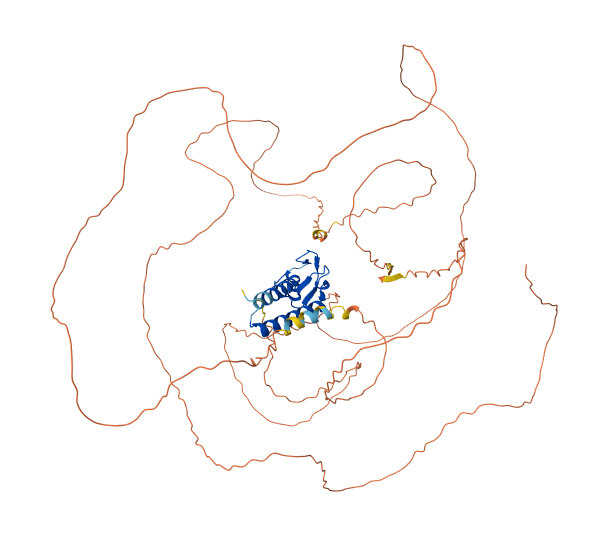</a> | <a href="esmfold2/P38398.png">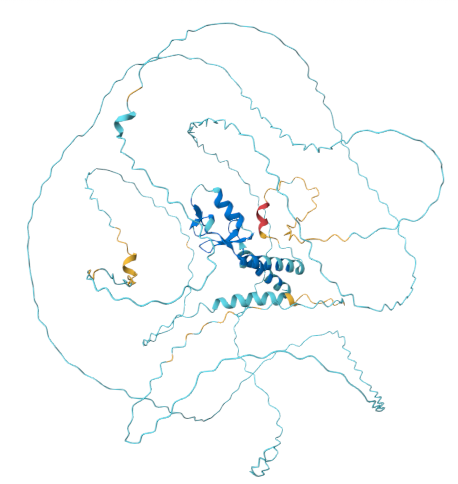</a> | [plot](#P38398-Breast-cancer-type-1-susceptibility-protein) |
| TP53-binding protein 1 | [Q12888](https://www.uniprot.org/uniprotkb/Q12888/entry#structure) | [DP02954](https://disprot.org/DP02954) | 1972 | 0.766 | 0.794 | <a href="alphafold2/Q12888.png">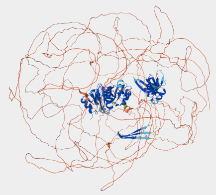</a> | <a href="alphafold3/Q12888.png">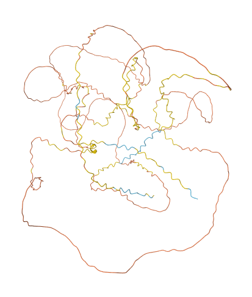</a> | <a href="esmfold2/Q12888.png">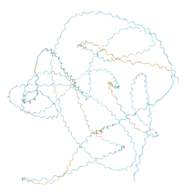</a> | [plot](#Q12888-TP53-binding-protein-1) |
| Dehydrin-like protein | [Q39805](https://www.uniprot.org/uniprotkb/Q39805/entry#structure) | [DP01035](https://disprot.org/DP01035) | 226 | 1.000 | 0.788 | <a href="alphafold2/Q39805.png">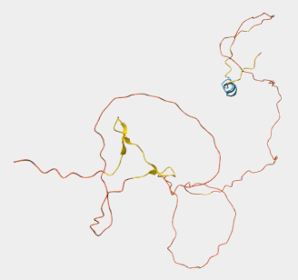</a> | <a href="alphafold3/Q39805.png">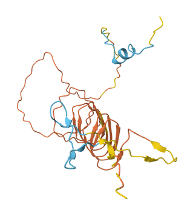</a> | <a href="esmfold2/Q39805.png">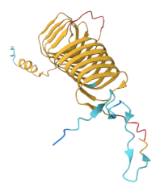</a> | [plot](#Q39805-Dehydrin-like-protein) |
| RNA-induced transcriptional silencing complex protein tas3 | [O94687](https://www.uniprot.org/uniprotkb/O94687/entry#structure) | [DP02421](https://disprot.org/DP02421) | 549 | 0.612 | 0.643 | <a href="alphafold2/O94687.png">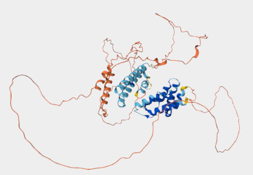</a> | <a href="alphafold3/O94687.png">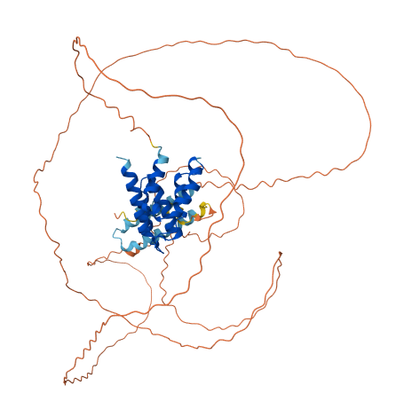</a> | <a href="esmfold2/O94687.png">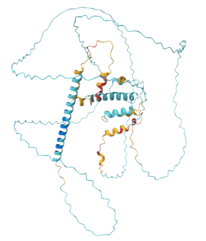</a> | [plot](#O94687-RNA-induced-transcriptional-silencing-complex-protein-tas3) |

---

## Per-protein pLDDT plots

### Q5NJL5 Late embryogenesis abundant protein

**UniProt:** [Q5NJL5](https://www.uniprot.org/uniprotkb/Q5NJL5/entry#structure) &nbsp;|&nbsp; **DisProt:** [DP01859](https://disprot.org/DP01859) &nbsp;|&nbsp; **Length:** 358 aa &nbsp;|&nbsp; **Disorder content:** 1.000 &nbsp;|&nbsp; **AF very low conf:** 1.000

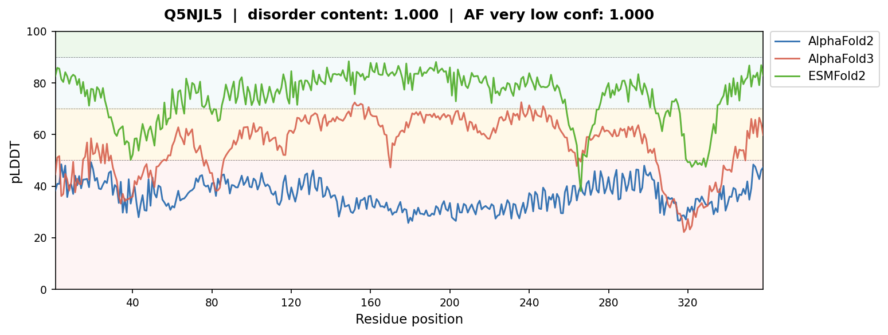


### Q2GI62 120 kDa immunodominant surface protein

**UniProt:** [Q2GI62](https://www.uniprot.org/uniprotkb/Q2GI62/entry#structure) &nbsp;|&nbsp; **DisProt:** [DP01875](https://disprot.org/DP01875) &nbsp;|&nbsp; **Length:** 548 aa &nbsp;|&nbsp; **Disorder content:** 0.146 &nbsp;|&nbsp; **AF very low conf:** 1.000

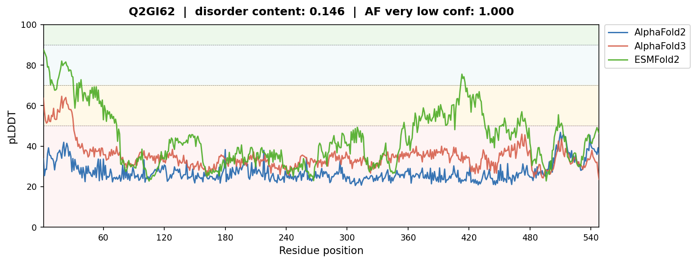


### P04985 Elastin

**UniProt:** [P04985](https://www.uniprot.org/uniprotkb/P04985/entry#structure) &nbsp;|&nbsp; **DisProt:** [DP01801](https://disprot.org/DP01801) &nbsp;|&nbsp; **Length:** 747 aa &nbsp;|&nbsp; **Disorder content:** 1.000 &nbsp;|&nbsp; **AF very low conf:** 0.973

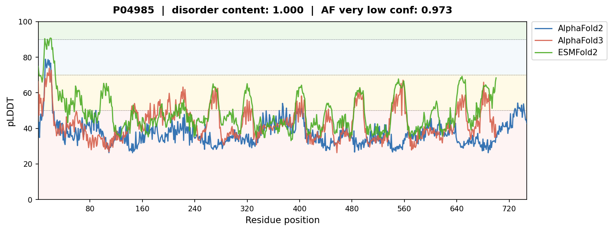


### Q44522 6b protein

**UniProt:** [Q44522](https://www.uniprot.org/uniprotkb/Q44522/entry#structure) &nbsp;|&nbsp; **DisProt:** [DP02668](https://disprot.org/DP02668) &nbsp;|&nbsp; **Length:** 204 aa &nbsp;|&nbsp; **Disorder content:** 0.064 &nbsp;|&nbsp; **AF very low conf:** 0.971

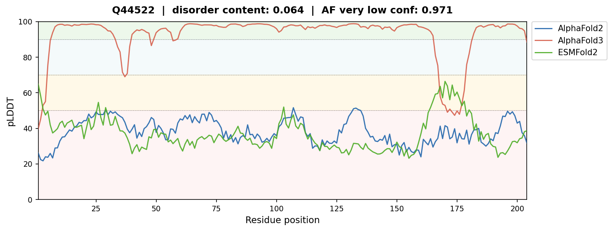


### B6KJB6 Putative transmembrane protein

**UniProt:** [B6KJB6](https://www.uniprot.org/uniprotkb/B6KJB6/entry#structure) &nbsp;|&nbsp; **DisProt:** [DP01535](https://disprot.org/DP01535) &nbsp;|&nbsp; **Length:** 542 aa &nbsp;|&nbsp; **Disorder content:** 0.380 &nbsp;|&nbsp; **AF very low conf:** 0.911

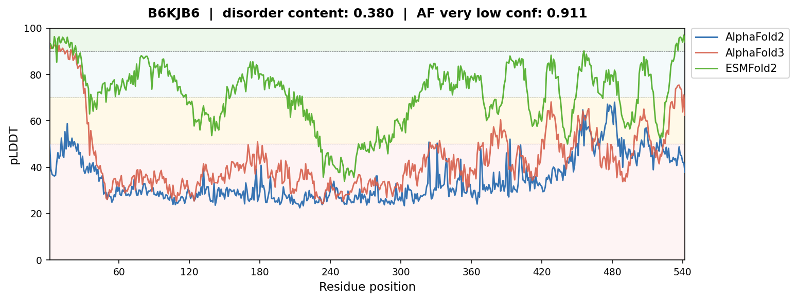


### P10388 Glutenin, high molecular weight subunit DX5

**UniProt:** [P10388](https://www.uniprot.org/uniprotkb/P10388/entry#structure) &nbsp;|&nbsp; **DisProt:** [DP00285](https://disprot.org/DP00285) &nbsp;|&nbsp; **Length:** 848 aa &nbsp;|&nbsp; **Disorder content:** 0.347 &nbsp;|&nbsp; **AF very low conf:** 0.899


### P08047 Transcription factor Sp1

**UniProt:** [P08047](https://www.uniprot.org/uniprotkb/P08047/entry#structure) &nbsp;|&nbsp; **DisProt:** [DP00378](https://disprot.org/DP00378) &nbsp;|&nbsp; **Length:** 785 aa &nbsp;|&nbsp; **Disorder content:** 0.276 &nbsp;|&nbsp; **AF very low conf:** 0.873


### Q9NP70 Ameloblastin

**UniProt:** [Q9NP70](https://www.uniprot.org/uniprotkb/Q9NP70/entry#structure) &nbsp;|&nbsp; **DisProt:** [DP02558](https://disprot.org/DP02558) &nbsp;|&nbsp; **Length:** 447 aa &nbsp;|&nbsp; **Disorder content:** 0.942 &nbsp;|&nbsp; **AF very low conf:** 0.870


### P20676 Nucleoporin NUP1

**UniProt:** [P20676](https://www.uniprot.org/uniprotkb/P20676/entry#structure) &nbsp;|&nbsp; **DisProt:** [DP01075](https://disprot.org/DP01075) &nbsp;|&nbsp; **Length:** 1076 aa &nbsp;|&nbsp; **Disorder content:** 0.722 &nbsp;|&nbsp; **AF very low conf:** 0.859


### P27058 Systemin

**UniProt:** [P27058](https://www.uniprot.org/uniprotkb/P27058/entry#structure) &nbsp;|&nbsp; **DisProt:** [DP01969](https://disprot.org/DP01969) &nbsp;|&nbsp; **Length:** 200 aa &nbsp;|&nbsp; **Disorder content:** 1.000 &nbsp;|&nbsp; **AF very low conf:** 0.845


### Q3LS93 Uncharacterized protein

**UniProt:** [Q3LS93](https://www.uniprot.org/uniprotkb/Q3LS93/entry#structure) &nbsp;|&nbsp; **DisProt:** [DP01777](https://disprot.org/DP01777) &nbsp;|&nbsp; **Length:** 329 aa &nbsp;|&nbsp; **Disorder content:** 0.936 &nbsp;|&nbsp; **AF very low conf:** 0.842


### P38398 Breast cancer type 1 susceptibility protein

**UniProt:** [P38398](https://www.uniprot.org/uniprotkb/P38398/entry#structure) &nbsp;|&nbsp; **DisProt:** [DP00238](https://disprot.org/DP00238) &nbsp;|&nbsp; **Length:** 1863 aa &nbsp;|&nbsp; **Disorder content:** 0.832 &nbsp;|&nbsp; **AF very low conf:** 0.803


### Q12888 TP53-binding protein 1

**UniProt:** [Q12888](https://www.uniprot.org/uniprotkb/Q12888/entry#structure) &nbsp;|&nbsp; **DisProt:** [DP02954](https://disprot.org/DP02954) &nbsp;|&nbsp; **Length:** 1972 aa &nbsp;|&nbsp; **Disorder content:** 0.766 &nbsp;|&nbsp; **AF very low conf:** 0.794


### Q39805 Dehydrin-like protein

**UniProt:** [Q39805](https://www.uniprot.org/uniprotkb/Q39805/entry#structure) &nbsp;|&nbsp; **DisProt:** [DP01035](https://disprot.org/DP01035) &nbsp;|&nbsp; **Length:** 226 aa &nbsp;|&nbsp; **Disorder content:** 1.000 &nbsp;|&nbsp; **AF very low conf:** 0.788


### O94687 RNA-induced transcriptional silencing complex protein tas3

**UniProt:** [O94687](https://www.uniprot.org/uniprotkb/O94687/entry#structure) &nbsp;|&nbsp; **DisProt:** [DP02421](https://disprot.org/DP02421) &nbsp;|&nbsp; **Length:** 549 aa &nbsp;|&nbsp; **Disorder content:** 0.612 &nbsp;|&nbsp; **AF very low conf:** 0.643


## Methods
`DisProt_release_2025_12.tsv` is from https://disprot.org/download.

Run a script on that file to add sequences and sequence prefixes:
```
$ python process_disprot.py DisProt_release_2025_12.tsv DisProt_release_2025_12_seqs.tsv
Loading DisProt_release_2025_12.tsv …
  10,399 rows, 2,341 unique UniProt ACCs
  Removed 0 obsolete rows → 10,399 remaining
  After deduplication: 2,341 unique proteins
Fetching sequences for 2,341 proteins from UniProt …
  [1/2341] Q5NJL5
  ...
  [2341/2341] O95071
Done! Wrote 2,341 rows to DisProt_release_2025_12_seqs.tsv
  [NOTE] 4 protein(s) had no sequence returned from UniProt.
```
The four proteins without sequences are no longer available in UniProtKB.

To generate structures and structure screenshots:
- Take "Sequence Truncated" sequence and predict structure with ESMFold2 at https://biohub.ai/tools/fold with the model esmfold2-2026-05. The web server does not explicitly state whether this is single sequence or MSA-conditioned prediction. I assume single sequence for now.
- Take "Sequence Truncated" sequence and predict structure with AlphaFold3 at https://alphafoldserver.com/.
- Download AlphaFold2 structure from UniProt.

The next script creates a summary table and line graphs of pLDDT across the three prediction methods:
```
$ python generate_analysis.py --tsv DisProt_release_2025_12_seqs.tsv --workdir .
Loading metadata from DisProt_release_2025_12_seqs.tsv …
  Found structure files for 15 proteins.

── Q5NJL5 (Late embryogenesis abundant protein, 358 aa) ──
  AF2:     358 residues parsed from PDB
  AF3:     358 residues parsed from zip/CIF
  ESMFold: 358 residues parsed from CIF
  Plot saved → analysis\Q5NJL5_plddt.png
...
```

## Future work
Did not yet annotate the line graphs with the disordered regions from DisProt, which is a possible extension.
For now, we can manually inspect these in `DisProt_release_2025_12.tsv`.
For example, O94687 has disordered region with ID DP02421r002 that starts at 117 and ends at 452.
This matches the region of low AlphaFold2 and AlphaFold3 pLDDT, but ESMFold2 has high pLDDT in this region.
Likewise, P38398 has many disordered regions, and DP00238r008 spans positions 100 to 1649.
Once again AlphaFold2 and AlphaFold3 have low pLDDT in this region (with a few exceptions), but ESMFold2 has high pLDDT (up until the truncated length of 700).

To confirm whether the ESMFold2 predictions are single sequence, rerun with MSAs using the [Colab notebook](https://colab.research.google.com/github/biohub/esm/blob/main/cookbook/tutorials/esmfold2.ipynb) (or locally).

Think more about any relevance to the 686 "Disorder / low complexity" features from the manuscript (Figure 4B).
